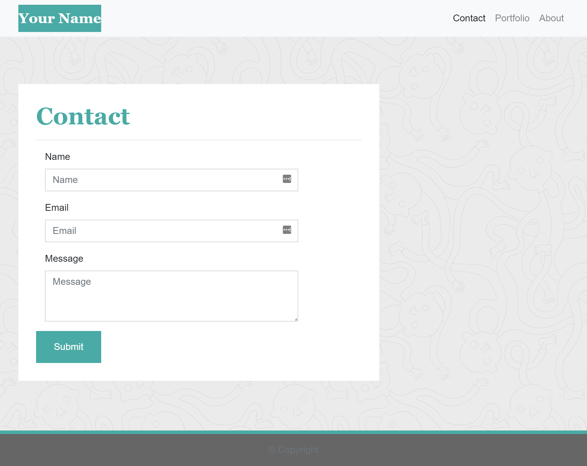

# **Responsive Portfolio**

## **Live Link**
 https://reanderson89.github.io/responsive-portfolio/

## **Contributors**
@reanderson89

## **Description**

This project was based around creating a webpage that was built to be responsive when adjusted to different pixel levels. It needed to have multiple links to it that would all work to navigate throughout the website. The webpages also needed to be built to look like the images given at the different sizes. I have attached the images that were given for reference. I also made sure to add in my own personal information since it is my own portfolio.

## **Technology Stack**

* HTML, CSS, Bootstrap

## **Images Given**
 

## **Finished Website Images**

(Please open up the live link at the top to take a look at the responsive build of the following pages)

## **Contact**

* #### **Name:** Robert Anderson (@reanderson89)
* #### **Email:** [reanderson89@gmail.com](reanderson89@gmail.com)

## **License**
MIT